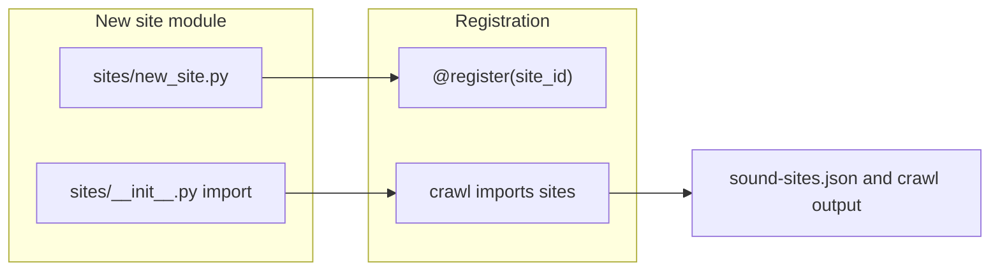

# Adding a site crawler

This guide describes how to **add another site-specific crawler** to the existing `soundpack_builder.crawlers` package. It does not replace the full sound-sourcing pipeline; see [`docs/sound-sourcing.md`](../sound-sourcing.md) for the end-to-end workflow (`search_hints` → optional `crawl` → `candidates` → `downloader` → …).

## Purpose and boundaries

- **Crawlers** automate **discovery**: they turn a universe/character query into candidate URLs (ZIPs, sound pages, or direct media) and write rows that the rest of the builder can consume (for example `manifests/candidates/<site-id>-crawl.json`, and optionally `--apply` into `universe-character-hook-candidates.json`).
- They are **not** a substitute for:
  - **`search_hints`** — that step only prints browser search URLs; nothing is fetched automatically.
  - **`downloader`** — crawlers do not replace downloading, transcription, or template generation.

Respect each site’s **terms of service**, **`robots.txt`**, and reasonable **rate limits** when running against live hosts. Prefer **offline tests** with saved HTML fixtures so CI does not depend on the network.

## Prerequisites

1. **Register the site id** in [`manifests/sound-sites.json`](../../manifests/sound-sites.json) **before** you reference that `siteId` from manifests or expect `candidates` to treat links as “verified.” Each row needs at least `id`, `name`, `url`, and `notes` (see [`docs/sound-sourcing.md`](../sound-sourcing.md) §A).

2. **Manifest layout** — For paths and conventions under `manifests/`, see [`manifests/README.md`](../../manifests/README.md).

## Implementation checklist

### 1. Subclass `SiteCrawler`

Implement a class in a new module under [`soundpack_builder/crawlers/sites/`](../../soundpack_builder/crawlers/sites/):

- **`build_search_url(query)`** — Build the search or listing URL for the site from [`CrawlQuery`](../../soundpack_builder/crawlers/models.py) (`universe`, `character`, `site_id`, `max_results`).
- **`fetch_results(query)`** — Fetch HTML (via `self.http`, a [`CrawlerHttpClient`](../../soundpack_builder/crawlers/http.py)), parse it, and return a list of [`CrawlResult`](../../soundpack_builder/crawlers/models.py) rows (include `result_url`, `title`, `score`, etc.).
- **`resolve_result(result, query)`** — Follow one result to a concrete downloadable or classifiable URL; return a [`CrawlCandidateLink`](../../soundpack_builder/crawlers/models.py) or `None`.

The default **`crawl()`** on [`SiteCrawler`](../../soundpack_builder/crawlers/base.py) iterates `fetch_results`, calls `resolve_result` until `max_results` links are collected.

Match the style of the reference implementation [`spriters_resource.py`](../../soundpack_builder/crawlers/sites/spriters_resource.py): stdlib **`HTMLParser`** and **regex** are fine unless the project later standardizes on another parser.

### 2. Register the crawler

- Set **`site_id`** on the class to the same string used in manifests.
- Decorate the class with **`@register("your-site-id")`** from [`soundpack_builder.crawlers.registry`](../../soundpack_builder/crawlers/registry.py).

### 3. Ensure the module is imported

**Registration only runs when the module is loaded.** Add an import for your new module in [`soundpack_builder/crawlers/sites/__init__.py`](../../soundpack_builder/crawlers/sites/__init__.py) (same pattern as `spriters_resource`). The CLI [`soundpack_builder/crawl.py`](../../soundpack_builder/crawl.py) imports `soundpack_builder.crawlers.sites` so all built-in crawlers register on startup.

### 4. Sourcing config and classification (if needed)

If URLs from the new site do not match the default discovery rules, update:

- [`manifests/sourcing-config.json`](../../manifests/sourcing-config.json) — global regex fallbacks and `fetch` behavior for `candidates --fetch-sound-pages`.
- Optional per-site **`discovery`** on the site row in `sound-sites.json` — e.g. `soundPageUrlRegexes` and `htmlEmbeddedAudioRegexes` (see [`docs/sound-sourcing.md`](../sound-sourcing.md)).

## Verification

### Manual run

From the repo root (with deps via `uv`; see root [`README.md`](../../README.md)):

```bash
uv run --project soundpack_builder python -m soundpack_builder.crawl --site-id <your-site-id> --universe <slug> --character <slug> --max-results 5
```

- Output defaults to `manifests/candidates/<site-id>-crawl.json` unless you pass `--out`.
- Use **`--apply`** only after you have reviewed output and are sure you want to append deduped links into `universe-character-hook-candidates.json`.

### Tests

Add tests in [`soundpack_builder/tests/test_crawlers.py`](../../soundpack_builder/tests/test_crawlers.py) and static HTML under [`soundpack_builder/tests/fixtures/crawlers/`](../../soundpack_builder/tests/fixtures/crawlers/) so tests do not hit the network. Cover:

- Search URL shape (`build_search_url`).
- Parsing and ordering of `fetch_results` (and `resolve_result` producing the expected `CrawlCandidateLink` URLs and `siteId`).

## Architecture sketch



## What not to duplicate here

- Full pipeline steps, downloader flags, and hook runtime setup live in [`docs/sound-sourcing.md`](../sound-sourcing.md) and [`docs/hooks-setup.md`](../hooks-setup.md).
